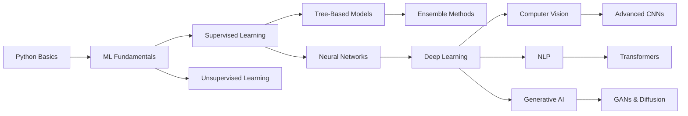

# 🧠 Complete ML & DL Algorithms Guide for AI Engineers

<div align="center">


[](https://opensource.org/licenses/MIT)
[](https://colab.research.google.com/)
[](CONTRIBUTING.md)

**Your definitive roadmap to mastering 15 Machine Learning & 20 Deep Learning algorithms**

[Getting Started](#-getting-started) • [Algorithms](#-algorithms-overview) • [Learning Path](#-learning-path) • [Use Cases](#-algorithm-use-cases) • [Contributing](#-contributing)

</div>

---

## 📖 About This Repository

This comprehensive guide provides **production-ready implementations** of essential ML and DL algorithms with:

✅ **Clear explanations** with mathematical formulas  
✅ **Hands-on Jupyter notebooks** for each algorithm  
✅ **Real-world use cases** and project examples  
✅ **Interview preparation** focus areas  
✅ **Visualizations** and comparative analysis  
✅ **Best practices** for deployment

Whether you're preparing for **interviews**, building **ML projects**, or advancing your **AI career**, this repository is your complete toolkit.

---

## 🎯 Algorithms Overview

### 🤖 Machine Learning (15 Algorithms)

| # | Algorithm | Primary Use | Interview Focus |
|---|-----------|-------------|-----------------|
| 1 | **Linear Regression** | Price prediction, forecasting | Gradient descent, regularization (Ridge/Lasso) |
| 2 | **Logistic Regression** | Binary classification | Sigmoid function, log loss, ROC-AUC |
| 3 | **Decision Trees** | Rule-based classification | GINI/Entropy, pruning, CART algorithm |
| 4 | **Random Forest** | High-accuracy ensemble | Bagging, OOB error, feature importance |
| 5 | **Gradient Boosting** | Competition-winning models | XGBoost/LightGBM/CatBoost, boosting vs bagging |
| 6 | **SVM** | High-dimensional data | Kernel trick, margin maximization |
| 7 | **K-Nearest Neighbors** | Similarity-based prediction | Distance metrics, curse of dimensionality |
| 8 | **Naive Bayes** | Text classification | Bayes theorem, conditional independence |
| 9 | **K-Means Clustering** | Customer segmentation | Elbow method, centroid initialization |
| 10 | **PCA** | Dimensionality reduction | Eigenvalues, variance explained |
| 11 | **Neural Networks** | Complex pattern recognition | Backpropagation, activation functions |
| 12 | **CNN** | Image processing | Convolutional layers, pooling, transfer learning |
| 13 | **RNN/LSTM/GRU** | Sequential data | Temporal dependencies, vanishing gradient |
| 14 | **Ensemble Methods** | Model stacking | Voting, blending, meta-learners |
| 15 | **Reinforcement Learning** | Decision-making agents | Q-learning, policy gradients, MDP |

### 🚀 Deep Learning (20 Algorithms)

<details>
<summary><b>Click to expand Deep Learning algorithms</b></summary>

| # | Algorithm | Architecture Type | Key Innovation |
|---|-----------|-------------------|----------------|
| 1 | **Feedforward Neural Network (MLP)** | Basic | Multi-layer perceptron foundation |
| 2 | **Backpropagation** | Training | Gradient-based optimization |
| 3 | **CNN** | Computer Vision | Convolutional feature extraction |
| 4 | **ResNet** | Computer Vision | Skip connections for deep networks |
| 5 | **VGGNet** | Computer Vision | Uniform 3×3 filters, depth scaling |
| 6 | **Inception (GoogLeNet)** | Computer Vision | Multi-scale feature extraction |
| 7 | **EfficientNet** | Computer Vision | Compound scaling (width/depth/resolution) |
| 8 | **RNN** | Sequential | Basic recurrent architecture |
| 9 | **LSTM** | Sequential | Long-term dependency handling |
| 10 | **GRU** | Sequential | Simplified LSTM with fewer gates |
| 11 | **Bidirectional LSTM** | Sequential | Bi-directional context processing |
| 12 | **Transformer** | Attention-based | Self-attention mechanism |
| 13 | **BERT** | NLP | Bidirectional encoder representations |
| 14 | **GPT** | NLP | Autoregressive language generation |
| 15 | **Vision Transformer (ViT)** | Computer Vision | Transformers for images |
| 16 | **GAN** | Generative | Adversarial training framework |
| 17 | **VAE** | Generative | Probabilistic latent space |
| 18 | **Diffusion Models** | Generative | State-of-the-art image synthesis |
| 19 | **Autoencoder** | Unsupervised | Feature learning and compression |
| 20 | **Graph Neural Networks** | Graph Data | Graph-structured data processing |

</details>

---

## 🚀 Getting Started

### Prerequisites

```bash
Python 3.8+
pip or conda package manager
(Optional) CUDA-enabled GPU for deep learning
```

### Installation

```bash
# Clone the repository
git clone https://github.com/yourusername/all-ml-dl-algorithms.git
cd all-ml-dl-algorithms

# Create virtual environment
python -m venv venv
source venv/bin/activate  # Windows: venv\Scripts\activate

# Install dependencies
pip install -r requirements.txt
```

### Quick Start with Google Colab

**No setup required!** Open any notebook directly in Google Colab:

[](https://colab.research.google.com/)

---

## 📂 Repository Structure

```
all-ml-dl-algorithms/
│
├── 📁 01_Machine_Learning/
│   ├── 📓 Linear_Regression.ipynb
│   ├── 📓 Logistic_Regression.ipynb
│   ├── 📓 Decision_Trees.ipynb
│   ├── 📓 Random_Forest.ipynb
│   ├── 📓 Gradient_Boosting.ipynb
│   ├── 📓 SVM.ipynb
│   ├── 📓 KNN.ipynb
│   ├── 📓 Naive_Bayes.ipynb
│   ├── 📓 KMeans_Clustering.ipynb
│   ├── 📓 PCA.ipynb
│   ├── 📓 Neural_Networks.ipynb
│   ├── 📓 CNN.ipynb
│   ├── 📓 RNN_LSTM_GRU.ipynb
│   ├── 📓 Ensemble_Methods.ipynb
│   └── 📓 Reinforcement_Learning.ipynb
│
├── 📁 02_Deep_Learning/
│   ├── 📓 FNN_MLP.ipynb
│   ├── 📓 Backpropagation.ipynb
│   ├── 📓 ResNet.ipynb
│   ├── 📓 VGGNet.ipynb
│   ├── 📓 Inception.ipynb
│   ├── 📓 EfficientNet.ipynb
│   ├── 📓 Bidirectional_LSTM.ipynb
│   ├── 📓 Transformer.ipynb
│   ├── 📓 BERT.ipynb
│   ├── 📓 GPT.ipynb
│   ├── 📓 Vision_Transformer.ipynb
│   ├── 📓 GAN.ipynb
│   ├── 📓 VAE.ipynb
│   ├── 📓 Diffusion_Models.ipynb
│   ├── 📓 Autoencoder.ipynb
│   └── 📓 GNN.ipynb
│
├── 📁 datasets/          # Sample datasets
├── 📁 utils/             # Helper scripts
├── 📁 visualizations/    # Algorithm comparisons
├── 📄 requirements.txt
├── 📄 CONTRIBUTING.md
├── 📄 LICENSE
└── 📄 README.md
```

---

## 📚 Learning Path



### Recommended Timeline (20-24 Weeks)

| Phase | Duration | Topics | Key Algorithms |
|-------|----------|--------|----------------|
| **Phase 1: Foundations** | 4 weeks | ML Fundamentals | Linear/Logistic Regression, Decision Trees |
| **Phase 2: Classical ML** | 4 weeks | Advanced ML | Random Forest, SVM, KNN, Naive Bayes |
| **Phase 3: Unsupervised** | 2 weeks | Clustering & DR | K-Means, PCA |
| **Phase 4: DL Basics** | 4 weeks | Neural Networks | FNN, CNN, RNN/LSTM |
| **Phase 5: Advanced DL** | 4 weeks | Modern Architectures | ResNet, Transformers, BERT, GPT |
| **Phase 6: Specialized** | 4 weeks | Cutting-edge | GANs, Diffusion, GNNs, RL |

---

## 💼 Algorithm Use Cases

### By Industry

<details>
<summary><b>Finance & Banking</b></summary>

- **Credit Risk Assessment:** Logistic Regression, XGBoost
- **Fraud Detection:** Random Forest, Isolation Forest, Autoencoders
- **Stock Price Prediction:** LSTM, Transformer
- **Algorithmic Trading:** Reinforcement Learning (Q-Learning)

</details>

<details>
<summary><b>Healthcare & Medicine</b></summary>

- **Disease Diagnosis:** CNN (Medical Imaging), SVM
- **Drug Discovery:** GNN, VAE
- **Patient Risk Prediction:** Gradient Boosting, Neural Networks
- **Medical Image Segmentation:** U-Net, ResNet

</details>

<details>
<summary><b>E-commerce & Retail</b></summary>

- **Recommendation Systems:** Collaborative Filtering (KNN), Neural Networks
- **Customer Segmentation:** K-Means, Hierarchical Clustering
- **Churn Prediction:** Logistic Regression, Random Forest
- **Dynamic Pricing:** Reinforcement Learning

</details>

<details>
<summary><b>Technology & AI Products</b></summary>

- **Chatbots & Assistants:** GPT, BERT, Transformer
- **Image Generation:** GAN, Diffusion Models, VAE
- **Code Generation:** GPT, Codex
- **Autonomous Systems:** Reinforcement Learning, CNN

</details>

---

## 🛠️ Tech Stack

<div align="center">

### Core Frameworks


### Boosting Libraries


### Visualization & Analysis


### Development Environment


</div>

---

## 🎓 Interview Preparation

### Top 10 Interview Questions by Algorithm

Each notebook includes:
- ✅ **Common interview questions** with detailed answers
- ✅ **Code challenges** with solutions
- ✅ **Time/space complexity** analysis
- ✅ **Comparison with alternatives**
- ✅ **When to use** decision framework

### Key Topics Covered

```
📌 Mathematical Foundations
   ├── Linear Algebra (Matrix operations, Eigenvalues)
   ├── Calculus (Gradients, Chain rule, Optimization)
   ├── Probability & Statistics (Bayes theorem, Distributions)
   └── Information Theory (Entropy, KL Divergence)

📌 Model Evaluation
   ├── Metrics (Accuracy, Precision, Recall, F1, ROC-AUC, RMSE)
   ├── Cross-validation (K-fold, Stratified, Time-series)
   ├── Overfitting vs Underfitting
   └── Bias-Variance Tradeoff

📌 Optimization
   ├── Gradient Descent (SGD, Adam, RMSprop)
   ├── Learning Rate Scheduling
   ├── Regularization (L1, L2, Dropout, Early Stopping)
   └── Hyperparameter Tuning (Grid Search, Random Search, Bayesian)

📌 Production & MLOps
   ├── Model Deployment (REST APIs, Flask, FastAPI)
   ├── Model Monitoring (Drift detection, A/B testing)
   ├── Scalability (Batch vs Online learning)
   └── Model Versioning
```

---

## 🤝 Contributing

We welcome contributions! Here's how:

1. **Fork** the repository
2. **Create** a feature branch (`git checkout -b feature/NewAlgorithm`)
3. **Commit** your changes (`git commit -m 'Add NewAlgorithm implementation'`)
4. **Push** to the branch (`git push origin feature/NewAlgorithm`)
5. **Open** a Pull Request

### Contribution Guidelines

- Follow **PEP 8** style guide
- Include **docstrings** and **comments**
- Add **unit tests** for new code
- Update **README** if adding new algorithms
- Provide **visualizations** where applicable

See [CONTRIBUTING.md](CONTRIBUTING.md) for detailed guidelines.

---

## 📝 License

This project is licensed under the **MIT License** - see the [LICENSE](LICENSE) file for details.

```
MIT License

Copyright (c) 2025 [Your Name]

Permission is hereby granted, free of charge, to any person obtaining a copy
of this software and associated documentation files (the "Software"), to deal
in the Software without restriction, including without limitation the rights
to use, copy, modify, merge, publish, distribute, sublicense, and/or sell
copies of the Software...
```

---

## 🌟 Show Your Support

If this repository helped you in your AI journey, please:

⭐ **Star** this repository  
🍴 **Fork** it for your projects  
📢 **Share** with fellow AI enthusiasts  
💬 **Open issues** for questions or suggestions


---

## 🙏 Acknowledgments

- **Open-source community** for frameworks like Scikit-Learn, TensorFlow, and PyTorch
- **Research papers** and academic contributions
- **Kaggle** competitions for practical insights
- **Industry practitioners** sharing best practices
- **Contributors** who make this resource better every day

---

## 📧 Contact & Support

- **Issues:** [GitHub Issues](https://github.com/yourusername/all-ml-dl-algorithms/issues)
- **Discussions:** [GitHub Discussions](https://github.com/yourusername/all-ml-dl-algorithms/discussions)
- **Email:** your.email@example.com
- **LinkedIn:** [Your Profile](https://linkedin.com/in/yourprofile)

---

## 🗺️ Roadmap

- [ ] Add more visualization notebooks
- [ ] Include TensorFlow & PyTorch implementations side-by-side
- [ ] Add deployment examples (Flask, FastAPI, Streamlit)
- [ ] Create video tutorials for each algorithm
- [ ] Add MLOps best practices
- [ ] Include edge case handling guides
- [ ] Add real-world project templates
- [ ] Create cheat sheets for quick reference

---

<div align="center">

**Made with 🧠, ☕, and a passion for AI**

**Happy Learning! 🚀**

[⬆ Back to Top](#-complete-ml--dl-algorithms-guide-for-ai-engineers)

</div>
