# 🧠 20 Deep Learning Algorithms for Every AI Engineer

<div align="center">


[](https://opensource.org/licenses/MIT)
[](https://colab.research.google.com/)
[](CONTRIBUTING.md)

</div>

---

## 📖 Description

A comprehensive collection of **20 essential Deep Learning algorithms** that every AI Engineer must master to excel in the industry. This repository provides implementations, explanations, and hands-on examples for each algorithm, covering everything from foundational neural networks to cutting-edge transformer architectures and generative models.

Whether you're building computer vision systems, natural language processing applications, or generative AI models, this curated list will serve as your complete roadmap to becoming a top-tier AI Engineer.

---

## 🎯 Algorithms Checklist

### 🔹 **Foundational Neural Networks**
- [ ] **Feedforward Neural Networks (FNN/MLP)** - Basic multi-layer perceptron architecture
- [ ] **Backpropagation Algorithm** - Core training algorithm using gradient descent

### 🔹 **Convolutional Neural Networks (Computer Vision)**
- [ ] **CNN (Convolutional Neural Networks)** - Image processing and feature extraction
- [ ] **ResNet (Residual Networks)** - Deep networks with skip connections
- [ ] **VGGNet** - Deep architecture with uniform filter sizes
- [ ] **Inception Networks (GoogLeNet)** - Multi-scale feature extraction
- [ ] **EfficientNet** - Efficient scaling of CNNs

### 🔹 **Recurrent Neural Networks (Sequential Data)**
- [ ] **RNN (Recurrent Neural Networks)** - Processing sequential data
- [ ] **LSTM (Long Short-Term Memory)** - Handling long-term dependencies
- [ ] **GRU (Gated Recurrent Unit)** - Simplified LSTM variant
- [ ] **Bidirectional LSTM/RNN** - Processing sequences in both directions

### 🔹 **Transformer Architecture (Modern NLP & Vision)**
- [ ] **Transformer** - Attention-based architecture (foundation of modern AI)
- [ ] **BERT** - Bidirectional encoder for language understanding
- [ ] **GPT (Generative Pre-trained Transformer)** - Autoregressive language models
- [ ] **Vision Transformer (ViT)** - Transformers applied to computer vision

### 🔹 **Generative Models**
- [ ] **GAN (Generative Adversarial Networks)** - Adversarial training for generation
- [ ] **VAE (Variational Autoencoder)** - Probabilistic generative models
- [ ] **Diffusion Models** - State-of-the-art image generation

### 🔹 **Specialized Architectures**
- [ ] **Autoencoder** - Unsupervised feature learning and compression
- [ ] **Graph Neural Networks (GNN)** - Processing graph-structured data

---

## 🛠️ Tech Stack

<div align="center">

### Programming Languages


### Deep Learning Frameworks


### Libraries & Tools


### Development Environment


### Version Control & Collaboration


</div>

---

## 🚀 Getting Started

### Prerequisites

```bash
Python 3.8 or higher
pip or conda package manager
```

### Installation

```bash
# Clone the repository
git clone https://github.com/yourusername/20-dl-algorithms.git
cd 20-dl-algorithms

# Create virtual environment
python -m venv venv
source venv/bin/activate  # On Windows: venv\Scripts\activate

# Install dependencies
pip install -r requirements.txt
```

### Quick Start with Google Colab

[](https://colab.research.google.com/)

Each algorithm has a dedicated Colab notebook for easy experimentation without local setup!

---

## 📂 Repository Structure

```
20-dl-algorithms/
│
├── 01_Fundamentals/
│   ├── FNN_MLP.ipynb
│   └── Backpropagation.ipynb
│
├── 02_Computer_Vision/
│   ├── CNN.ipynb
│   ├── ResNet.ipynb
│   ├── VGGNet.ipynb
│   ├── Inception.ipynb
│   └── EfficientNet.ipynb
│
├── 03_Sequential_Data/
│   ├── RNN.ipynb
│   ├── LSTM.ipynb
│   ├── GRU.ipynb
│   └── Bidirectional_LSTM.ipynb
│
├── 04_Transformers/
│   ├── Transformer.ipynb
│   ├── BERT.ipynb
│   ├── GPT.ipynb
│   └── Vision_Transformer.ipynb
│
├── 05_Generative_Models/
│   ├── GAN.ipynb
│   ├── VAE.ipynb
│   └── Diffusion_Models.ipynb
│
├── 06_Specialized/
│   ├── Autoencoder.ipynb
│   └── GNN.ipynb
│
├── requirements.txt
├── LICENSE
└── README.md
```

---

## 📚 Learning Path

```mermaid
graph TD
    A[Start: Python Basics] --> B[Fundamentals: FNN & Backprop]
    B --> C[Computer Vision: CNNs]
    B --> D[Sequential Data: RNNs/LSTMs]
    C --> E[Advanced CV: ResNet, ViT]
    D --> F[Transformers: BERT, GPT]
    E --> G[Generative Models]
    F --> G
    G --> H[Specialized: GNN, Autoencoders]
    H --> I[Master AI Engineer! 🎓]
```



**Recommended Timeline**: 16-20 weeks (4-5 months)

---

## 💡 Use Cases by Algorithm

| Algorithm | Primary Use Cases |
|-----------|------------------|
| **CNN** | Image Classification, Object Detection |
| **ResNet** | Deep Image Recognition, Medical Imaging |
| **LSTM** | Time Series, Speech Recognition, Text Generation |
| **Transformer** | Machine Translation, Text Summarization |
| **BERT** | Question Answering, Sentiment Analysis |
| **GPT** | Text Generation, Code Generation, Chatbots |
| **GAN** | Image Generation, Data Augmentation |
| **Diffusion** | High-Quality Image Synthesis, Inpainting |
| **GNN** | Social Networks, Molecular Property Prediction |

---

## 🤝 Contributing

Contributions are always welcome! Please follow these steps:

1. Fork the repository
2. Create your feature branch (`git checkout -b feature/AmazingAlgorithm`)
3. Commit your changes (`git commit -m 'Add some AmazingAlgorithm'`)
4. Push to the branch (`git push origin feature/AmazingAlgorithm`)
5. Open a Pull Request

Please read [CONTRIBUTING.md](CONTRIBUTING.md) for details on our code of conduct.

---

## 📝 License

This project is licensed under the MIT License - see the [LICENSE](LICENSE) file for details.

```
MIT License

Copyright (c) 2025 [Your Name]

Permission is hereby granted, free of charge, to any person obtaining a copy
of this software and associated documentation files (the "Software"), to deal
in the Software without restriction, including without limitation the rights
to use, copy, modify, merge, publish, distribute, sublicense, and/or sell
copies of the Software, and to permit persons to whom the Software is
furnished to do so, subject to the following conditions...
```

---

## 📬 Contact & Support

<div align="center">

[](https://github.com/yourusername)
[](https://linkedin.com/in/yourprofile)
[](https://twitter.com/yourhandle)
[](mailto:your.email@example.com)

</div>

---

## ⭐ Show Your Support

If this repository helped you in your AI journey, please give it a ⭐️!

---

## 🙏 Acknowledgments

- Thanks to the open-source community for amazing frameworks
- Inspired by research papers and industry best practices
- Built with ❤️ for aspiring AI Engineers

---

<div align="center">

**Made with 🧠 and ☕ | Happy Learning! 🚀**


</div>
